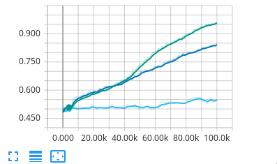
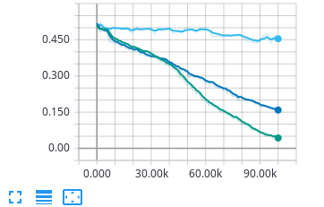
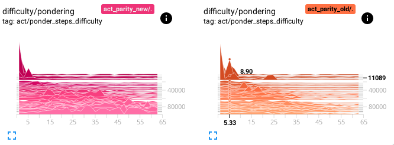
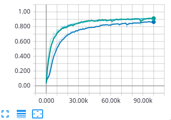
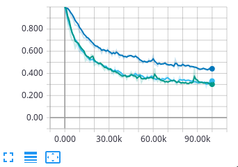
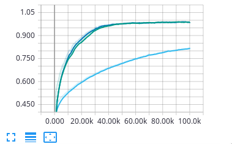
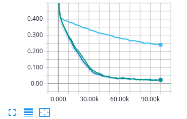
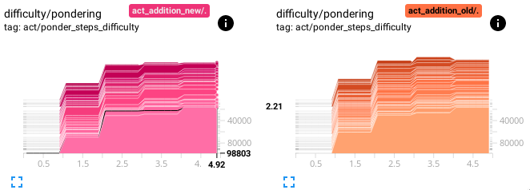

## Adaptive Computation Time

Alternative approach on [Adaptive Computation Time for Recurrent Neural Networks](https://arxiv.org/abs/1603.08983) by Alex Graves in TensorFlow.

**Contributor**: [Berkay Antmen](http://www.berkayantmen.com/), [Divyam Madaan](https://divyam3897.github.io/), [Bryan M. Li](https://bryanli.io), [Aidan N. Gomez](https://aidangomez.ca/)

### Idea
We use a small trick to help with the training of ACT modules. The idea is to penalize pondering less when the model is incorrect and more when it is correct. 

In effect, relaxing the objective constraints when the model is struggling and then asking for computation efficiency only once the model has solved the problem. We implement this simply by scaling the ponder cost term by the inverse of the task loss. See function [`calculate_ponder_cost()`](./models/ACT/act.py#L107)

To use new ponder cost, set flag `--use_new_ponder_cost=True`

### Running this Code
Call `pip install -r requirements.txt` to install all dependencies.


### Training Data
- [parity](data/parity_reader.py)
- [sort](data/sort_reader.py)
- [addition](data/addition_reader.py)


### Sample Call
The settings for the reader used is passed as flag. For example, to run the parity task, call:
```
python -m ACT.train --model=act --hparam_sets=act_parity  --output_dir=runs/act_parity --data=parity  --train_steps=100000
```


### Results
| Task | Accuracy | Sequence error rate | Pondering |
|:---:|:---:|:---:|:---:|
| Parity |  |  |  |
| Sort |  |  |  |
| Addition |  |  |  |

Results for parity, sort and addition tasks are displayed. Light blue color represents LSTM cell, dark blue represents ACT cell with old ponder cost and green represents ACT cell with our new ponder cost.

The model with the new ponder cost ponders comparatively more than the model with the original ponder cost. The ACT cell with new ponder cost performed better than the old ponder cost for parity task, though performed similarly for sort and addition tasks.

### Contributing
We'd love to accept your contributions to this project. Please feel free to open an issue, or submit a pull request as necessary. If you have implementations of this repository in other ML frameworks, please reach out so we may highlight them here.


### Acknowledgment
The ACT code is build upon [DeNeutoy/act-tensorflow](https://github.com/DeNeutoy/act-tensorflow)
